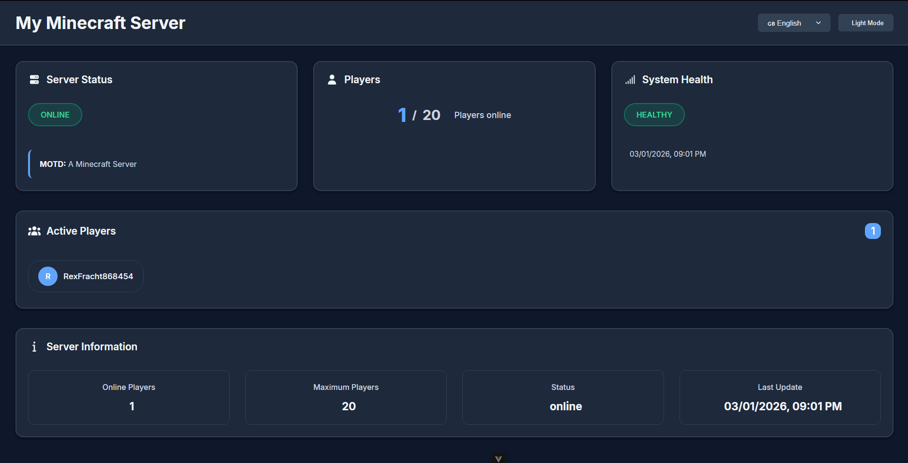
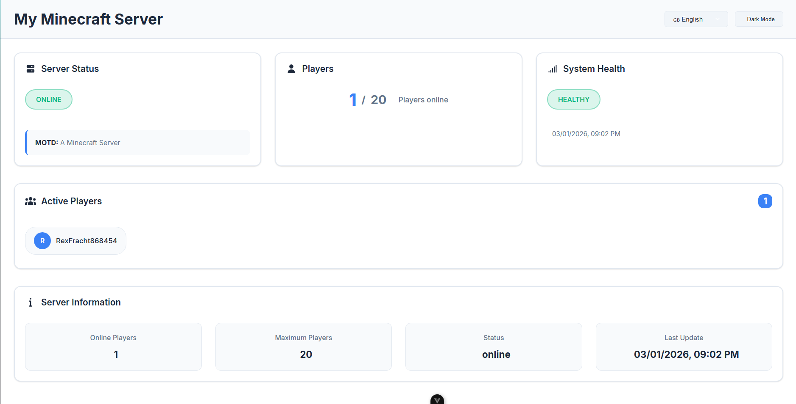
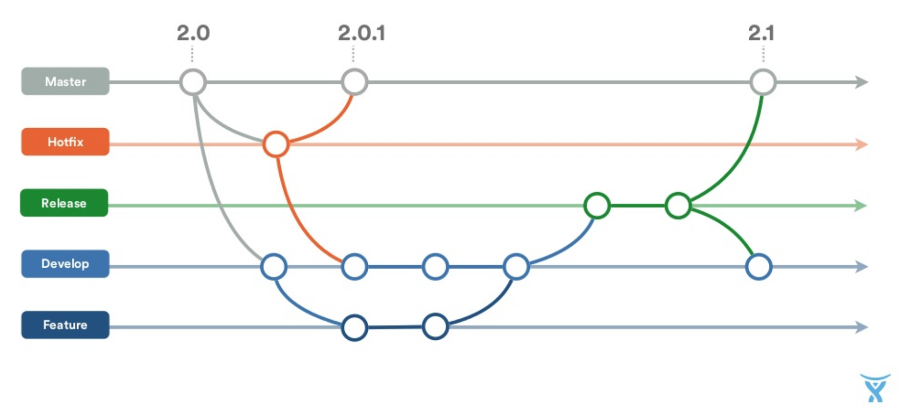

<div align="center">
  
</div>
ServerStats is a practical tool for Minecraft Spigot servers that creates a seamless connection between your server and an external website.

The plugin (`ServiceProvider`) runs directly on the Minecraft server and provides its own REST API.
This API can be queried by your website to display real-time information and live statistics about your server (for example player counts, server performance, or online status) in a clear and modern web dashboard.

## ✨ Features

The ServerStats dashboard provides you and your community with a modern and clear live overview of your server.

🟢 **Live Server Status:** Displays whether the server is currently online or offline in real time, including the current MOTD (Message of the Day).

👥 **Player Statistics:** Clear overview of the current player count compared to the maximum number of available slots.

🧑‍🤝‍🧑 **Active Player List:** Shows all currently connected players with their names and automatically generated avatars.

⚡ **System Health:** Monitors server performance (for example Healthy or Warning) including a timestamp of the last update.

🔄 **Auto Refresh:** The dashboard updates automatically in the background at a configurable interval without reloading the page.

🌓 **Modern UI:** Responsive design (works perfectly on smartphones), built-in dark/light mode, and smooth animations.

🌍 **Multilingual Support:** The website supports multiple languages through an integrated i18n system.

Dark Mode:  


Light Mode:


## 📋 Requirements (Voraussetzungen)

**Minecraft Server:**

- A server running **Spigot**.
- **Minecraft Version:** `1.21` (or compatible).
- **Java:** Java 21 (standard requirement for Minecraft 1.21)
- An open port for the REST API (default: `8080`) that is allowed in your server or hosting firewall

**Webseite:**

- A regular web server or web hosting (for example Apache or Nginx)
- **No Node.js, PHP, or database required** – the dashboard consists entirely of static HTML and JavaScript files.

## ⚙️ Installation & Setup

The setup consists of two parts:  
**1.** The plugin for the Minecraft server  
**2.** The website files

### 1. Setup the Spigot Plugin (`ServiceProvider`)

To allow the server to provide the data, the plugin must be installed.

**1. Download**  
Download the latest version of `ServiceProvider.jar` from the Releases section.

**2. Install**
Move the downloaded `.jar` file into the `plugins` folder of your Minecraft server.

**3. Restart**
Restart the Minecraft server.

**4. Configure**
After the first start, the plugin will automatically create a folder: `plugins/ServiceProvider/`

Inside this folder you will find a `config.yml` where you can configure the API port and security settings (see below).

---

### Plugin Configuration (`config.yml`)

In the plugin configuration you define which IP addresses can access the API and on which port the local web server runs.

Default configuration:

```yaml
# Allowed ip´s for api
allowed-ips:
  - "127.0.0.1"
  - "localhost"
  - "192.168.1.100"
  - "::1" # IPv6 localhost
  - "0.0.0.0"

# API Port
api-port: 8080

# CORS settings
cors:
  enabled: true
  allowed-origins: "*"
```

### 2. Setup the Website

The frontend is built as a static **website**.  
This means:

- No Node.js required
- No build step required
- No database required

Any normal web server (Apache, Nginx, or simple web hosting) is completely sufficient.

**Steps:**  
**1. Download**  
Download the latest `serverstats-web.zip` from the Releases section.

**2. Extract Files**  
Extract the contents of the `.zip` file into the root directory (webroot) of your web server.

**3. Configure**  
Open the file `config.js` using any text editor.

**4. Open the Website**  
Access your website in your browser.

---

### Website Configuration (`config.js`)

The entire website configuration is handled through the `config.js` file located in the root directory of your web files.

You can change the configuration at any time without rebuilding the site. Simply refresh the page after saving the file.

Default configuration:

```javascript
window.SERVER_STATS_CONFIG = {
  // Address of your Minecraft server REST API (including port)
  apiUrl: "http://dein-server-ip:8080",

  // Name of your server (for example displayed in the browser tab)
  serverName: "Mein Minecraft Server",

  // Automatic refresh interval in milliseconds
  // 10000 = 10 seconds
  refreshInterval: 10000,
};
```

## 🤝 Contributing

We welcome contributions to ServerStats! To maintain a clean structure and high code quality, please follow these guidelines:

1.  **Issues First:** Before you start working, please check the [Issues](https://github.com/finnley07/ServerStats/issues) tab. Either pick an existing task or create a new issue to discuss your planned changes before starting.
2.  **Gitflow Workflow:** We follow the **Gitflow** branching model.
    - Create a dedicated branch for new features or bugfixes starting from the `develop` branch (e.g., `feature/your-feature-name` or `bugfix/issue-description`).
    - Please target all Pull Requests towards the **`develop`** branch, not `main`.
3.  **Code Style:** Ensure your code is clean and follows the existing Vue.js structure for the web part and Spigot standards for the plugin.

<div align="center">
  
</div>
